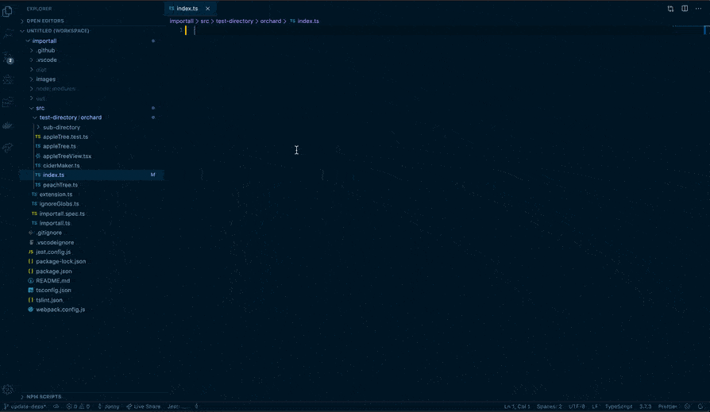

# importall

### Allows easy importing and exporting of all files local to a directory.

## Instructions
- Press `ctrl + space` on a ts or tsx file
- `import all` and `export all` will import and export all modules and types in the current directory of the file

